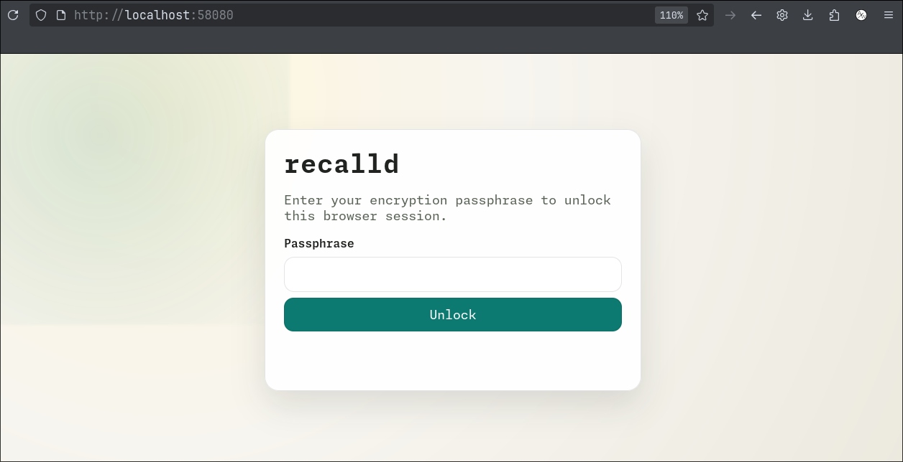
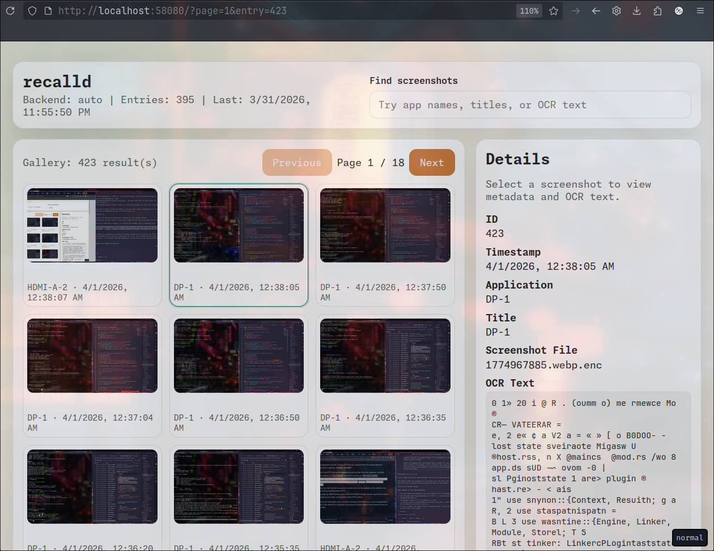

# recalld
Retrace your steps in Wayland 🐧


## Usage 

### CLI

```console
$ ./target/release/recalld --help
Linux screen recall daemon

Usage: recalld <COMMAND>

Commands:
	daemon  Start the daemon (capture loop + gRPC server)
	search  Search stored screenshots by semantic query
	status  Show daemon status
	plugin  Manage plugins
	config  Write config file to stdout
	help    Print this message or the help of the given subcommand(s)

Options:
	-h, --help     Print help
	-V, --version  Print version
```

### HTTP Server

The web UI is not a separate service. It is an HTTP server started from the same daemon process that already owns capture, storage, and gRPC.

- The gRPC server and HTTP server are spawned side-by-side from the daemon runtime.
- By default gRPC listens on `[::1]:50051` and HTTP listens on `127.0.0.1:58080`.
- The browser sends the encryption passphrase to the daemon over localhost HTTP for login verification. The daemon uses it to test-unlock key.enc, issues a session cookie on success, and keeps the DEK server-side.
- Screenshot bytes are still stored encrypted on disk and are decrypted by the daemon on demand before being returned over HTTP.
- Search, gallery paging, detail lookup, and screenshot retrieval all execute against the same in-process storage/query layer used by the native API surface.

In practice this means the web path is just another daemon interface, not a second application stack. 

#### UI

> This is a preview, expect functionality to lag behind core features





### Status 

```console
jesse@archl:~/gh/recalld^main ♥
$ RUST_LOG=recalld::daemon=debug,recalld::embedding=debug ./target/release/recalld status
Status:          running
Uptime:          5985s
Total entries:   237
Last capture:    ts=1774961692
Capture backend: auto
Active plugins:  0
```

## Files

```console
/home/jesse/.local/share/recalld
├── key.enc
├── recalld.db
├── recalld.db-shm
├── recalld.db-wal
└── recalld.pid
```


> [!WARNING] 
> 🤖 You didn't write this below...might be correct, totally false or somewhere inbetween 🤷

## Capture Tuning

`capture.similarity_threshold` controls how aggressively recalld skips visually similar screenshots.

- `1.0` is strict: only nearly identical frames are skipped.
- `0.9` allows up to 6 differing perceptual-hash bits out of 64 before storing a new frame.
- `0.1` allows up to 57 differing bits out of 64, which will treat most browser-page changes as unchanged.

The daemon compares each frame against the last captured frame on that monitor, not only the last stored frame.

## Runtime Notes

recalld uses Tokio's default multi-thread runtime. OCR, embedding, and storage work run off the async request path, but they are still CPU- and I/O-heavy; high values such as `processing.embedding_threads = 4` can make the desktop feel busy even when the runtime itself is not starved.

recalld intentionally limits thread counts, but it no longer pins heavy work to a fixed subset of CPUs by default. Pinning looked good on paper and turned out to be a bad fit for desktop responsiveness because it could force compositor and input work to compete with OCR and inference on the same cores.
